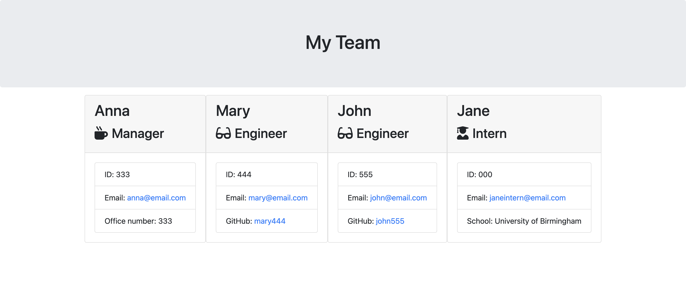

# Team Generator

## Description
This is a Node.js command-line application that takes in information about employees on a software engineering team and generates an HTML webpage that displays summaries for each person.

The application uses the [Inquirer package](https://www.npmjs.com/package/inquirer) to prompt the user for information and the [Jest package](https://www.npmjs.com/package/jest) to run unit tests.



## Installation
To install necessary dependencies, run the following command:
```
npm install
```
## Usage
To use this application, run the following command:
```
node index.js
```
## License
This project is licensed under the MIT license.